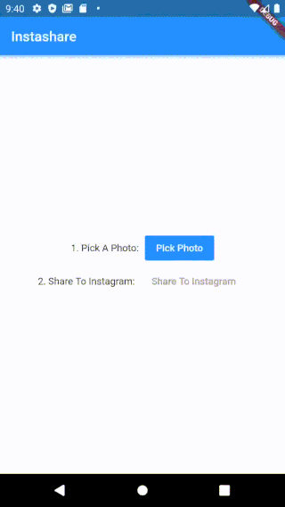
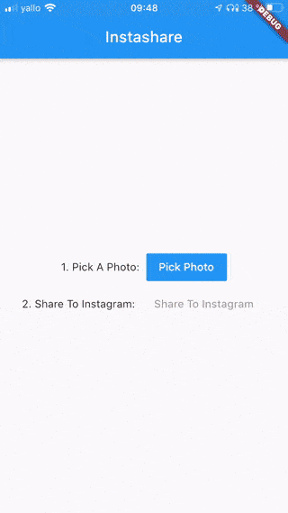

# instashare
Share easily and directly to Instagram.

Inspired and adapted from [attilaroy](https://github.com/attilaroy/share-instagram-swift) (iOS) and [romatroskin](https://github.com/romatroskin/social_share_plugin) (Android)

## Installation (Flutter)
Add this to your `pubspec.yaml`
```yaml
dependencies:
  ...

  instashare:
    git:
      url: https://github.com/devs-group/flutter_insta_share.git

  ...
```

## Android


You don't need to configure anything for Android.

## iOS


Open your `info.plist` and add
```xml
<plist version="1.0">
    <dict>
        ...

        <key>LSApplicationQueriesSchemes</key>
        <array>
            <string>instagram</string>
        </array>
        <key>NSCameraUsageDescription</key>
        <string>This app needs to access your camera so you can take and add photos easily into the app.</string>
        <key>NSPhotoLibraryUsageDescription</key>
        <string>This app needs access to your gallery so you can pick images or share to Instagram.</string>

        ...
    </dict>
</plist>
```

> Mind that you can write anything inside the **NSCameraUsageDescription** and **NSPhotoLibraryUsageDescription** \<string\> block. This is just an example text.

## Usage
In your `.dart` file import the library with

```dart
import 'package:instashare/instashare.dart';
```

then call the method with (eg.)

```dart
Future<void> sharePost(File file) {
    int result = await Instashare.shareToFeedInstagram("image/*", file.path);
    if (result != InstashareStatus.Done.index) {
        throw (result);
    }
}
```

as you can see i added multiple result integers as an return value.

You can check the result against those:

```dart
- InstashareStatus.Done (equals to 0)
  // Successful sharing

- InstashareStatus.WriteFileError (equals to 1)
  // Writing the file did not work (iOS only)

- InstashareStatus.WritePhotoAlbumError (equals to 2)
  // Writing the file to Photo Album did not work (iOS only)

- InstashareStatus.InstagramNotInstalledError (equals to 3)
  // Instagram is not installed (or at least is not recognized)

- InstashareStatus.AccessingPhotosError (equals to 4)
  // User did not allow to access photo library (iOS only)
```

> Mind: Always use the `.index` function like `InstashareStatus.Done.index` to compare against the result.

## Example
You can also simply use my example app and check out the code.

1. Open your emulator or connect your device
2. `cd example`
3. `flutter run -t lib/main.dart --debug`

## Todo
- If possible remember the generated photo (iOS only) in the gallery and delete it when the user comes back into the app.
